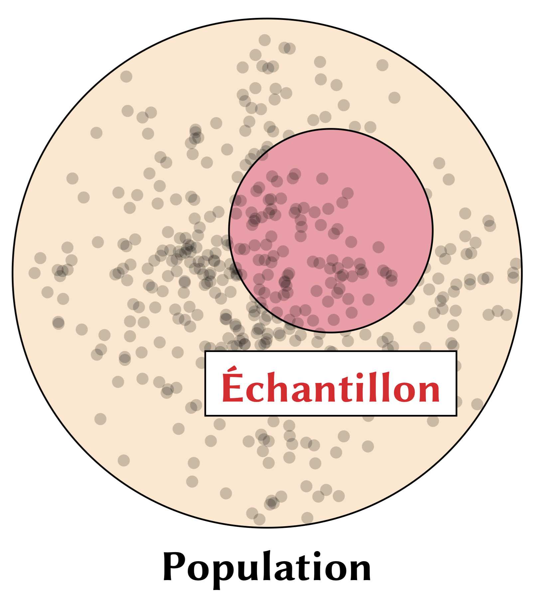

```{=html}
<style>
img.wrapfig {
    float: right; 
    margin: 10px;
}
</style>
```
```{r setup, include = FALSE}
knitr::opts_chunk$set(
    collapse = TRUE,
    comment = "#>",
    fig.retina=TRUE,
    # fig.width=7,    # Default width
    # fig.height=5,   # Default height
    fig.dpi=800     # High resolution
)


```


## Introduction

{.wrapfig width="35%"}Jusqu'ici, on a [importé](intro_a_r.html), [exploré et visualisé des données](exploration_a.html). Maintenant, on commence la partie de l'**analyse statistique**. Dans notre séance, on a examiné quelques concepts importants :

-   échantillon vs. population
-   test $t$ et valeur $p$
-   hypothèse nulle H$_0$


Simplement dit, on utilise un échantillon pour **estimer** un paramètre d'une population entière---c'est la notion de l'**inférence statisique**. Normalement, notre paramètre d'intérêt est la **moyenne** quand on parle des tests $t$, par exemple. 


:::{.callout-tip}
## Des symboles importants

- $\mu$ : moyenne de la population, c'est-à-dire la moyenne de toutes les valeurs dans une population complète.  
- $\sigma$ : écart type de la population, qui mesure la dispersion des valeurs autour de la moyenne dans une population complète.  
- $\bar{x}$ : moyenne de l'échantillon, soit la moyenne calculée à partir d'un sous-ensemble de la population.  
- $s$ : écart type de l'échantillon, qui mesure la dispersion des valeurs autour de $\bar{x}$ pour l'échantillon.  

Ces symboles sont standard en statistiques et reflètent la distinction entre paramètres de la population (lettres grecques) et statistiques d'échantillon (lettres latines).

:::


Dans la séance, on a comparé les notes des apprenants de français comme langue seconde à Québec et à Montréal. La question était : « les moyennes des notes entre les deux groupes sont-elles différentes? ». Deux groupes auront normalement des moyennes différentes. La question est vraiment si cette différence-là est statistiquement réelle.

Comme d'habitude, c'est une bonne idée de visualiser les données pour commencer notre analyse. Voici la figure utilisée dans les diapos de la séance :

```{r}
#| eval: true
#| echo: false
#| fig-align: center
#| fig-width: 5
#| out-width: 80%
#| fig-height: 4
#| message: false
#| warning: false
library(tidyverse)

villes = read_csv("donnees/villes.csv")

ggplot(data = villes, aes(x = note)) + 
  geom_histogram(aes(fill = ville, y = ..density..), 
                 alpha = 0.3, color = "black",
                 binwidth = 2, show.legend = FALSE) +
  geom_density(aes(color = ville), size = 3) + 
  theme_minimal() + 
  theme(legend.position = "top") +
  labs(x = "Distribution des notes",
       y = "Densité",
       title = "Échantillons",
       color = "Ville:",
       subtitle = "Montréal et Québec") +
  scale_fill_manual(values = c("darkviolet", "steelblue4"), guide = FALSE) +
  scale_color_manual(values = c("darkviolet", "steelblue4"))


```

L'histogramme (`geom_histogram()`) nous donne les distributions des deux échantillons en question. On voit beaucoup de superposition entre les deux groupes quand on examine les barres de l'histogramme. Par contre, les lignes qui représentent les densités de chaque distribution suggèrent une possible différence entre les deux groupes. Pour vérifier la différence, on a exécuté un test $t$ avec la fonction `t.test()` :

```{r}
#| code-fold: false
#| echo: true
t.test(note ~ ville, data = villes)
```

Faites attention à la syntaxe de la fonction : `note ~ ville`. Cela nous dit que l'objet de l'analyse est la `note` (la variable de **réponse**, aussi connue comme la « variable dépendante »). La variable `ville` est la variable **prédictive**, aussi connue comme la « variable indépendante ».

On observe dans les résultats du test que la valeur $p$ est extrêmement basse. R utilise par défaut la notation scientifique, donc : `8.385e-05` $= 8.385^{-5} = 0.0000835$. Simplement dit, notre valeur $p$ est inférieure à 0,05 (le seuil normalement utilisé dans les sciences sociales et dans la linguistique). Donc, on conclut que les deux groupes sont statistiquement différents. Autrement dit, on a des évidences statistiques pour dire que les deux échantillons viennent des deux populations distinctes.

## Le test *t*

Bien que notre cours ne soit pas un cours de statistique, c'est utile de connaître la formule du test $t$. Voici le test $t$ de Welch (la version utilisée dans la fonction `t.test()`, qui suppose des variances inégales).

$$ t = \frac{\bar{x}_1 - \bar{x}_2}{s \cdot \sqrt{\frac{1}{n_1} + \frac{1}{n_2}}} = \frac{\bar{x}_1 - \bar{x}_2}{\sqrt{s^2 \left(\frac{1}{n_1} + \frac{1}{n_2}\right)}} = \frac{\bar{x}_1 - \bar{x}_2}{\sqrt{\frac{s^2}{n_1} + \frac{s^2}{n_2}}}$$


-   $\bar{x} \rightarrow$ la moyenne de chaque groupe (1 et 2)
-   $s^2 \rightarrow$ la variance^[La variance mesure à quel point les valeurs s’écartent de la moyenne.] (fonction `var()`) de chaque groupe (1 et 2)
-   $n \rightarrow$ la taille de chaque échantillon (1 et 2)

::: {.callout-important collapse="true"}
## Le code

Avec `summarize()`, vous pouvez générer toutes les valeurs nécessaires pour le calcul en question.

```{r} 
villes |> 
  summarize(
    moyenne = mean(note),
    variance = var(note),
    echant = n(),
    .by = ville
  )
```

Vous pouvez également calculer la statistique $t$ de façon manuelle :

```{r} 
#| eval: false

# NOTE: On calcule la statistique t ici.

villes <- read_csv("donnees/villes.csv")

# NOTE: Extraire les notes de chaque ville :
#
# NOTE: Les notes de Montréal
montreal <- villes |>
  filter(ville == "Montréal") |>
  pull(note) # pull() extrait las valeurs d'une colonne

# NOTE: Les notes de Québec
quebec <- villes |>
  filter(ville == "Québec") |>
  pull(note)

# NOTE: Calculer les moyennes :
mm <- mean(montreal) # moyenne de Montréal
mq <- mean(quebec) # moyenne de Québec

# NOTE: La taille des échantillons :
nm <- length(montreal) # lenght() marche ici parce que montreal est un vecteur
nq <- length(quebec)

# On constate que nm = nq :
nm == nq

# Donc, on peut simplment dire :
n <- nm

# NOTE: Calculer les variances manuellement :
vm <- sum((montreal - mm)^2) / (n - 1)
# Vérifier que le calcul est correct :
var(montreal) == vm

vq <- sum((quebec - mq)^2) / (n - 1)
# Vérifier que le calcul est correct :
var(quebec) == vq


# NOTE: Maintenant, on a toutes les variables nécessaires
# pour le calcul de t :
t <- (mm - mq) /
  sqrt(
    (vm / n) +
      (vq / n)
  )

# NOTE: Comparez les deux méthodes :
t # manuel
t.test(montreal, quebec) # automatique en séparant les villes avant
t.test(note ~ ville, data = villes) # automatique avec un tableau de données

# Vous pouvez extraire la valeur t du test aussi :
t.test(note ~ ville, data = villes)$statistic
```


:::

Quand on exécute la fonction `t.test()`, R nous donne une valeur $t$. Dans le passé, lorsque les gens calculaient tout manuellement, on utilisait un tableau physique pour décider si l'hypothèse nulle serait rejetée ou non (consultez les diapos de la séance 4). Il y a plusieurs vidéos sur YouTube qui révisent le calcul si vous êtes intéressé·e. Heureusement, c'est beaucoup plus facile aujourd'hui d'exécuter ce type de test. Par contre, quand il est *trop* facile, on a tendance à négliger ce qui se passe réellement derrière la fonction. On ne va pas utiliser le test $t$ dans notre cours, mais il s'agit d'un test utile pour réviser les notions de base de la statistique.


## La valeur *p*

La **p-value**, ou "valeur p", est une mesure utilisée en statistique pour répondre à une question fondamentale : *"Les résultats observés sont-ils dus au hasard, ou indiquent-ils quelque chose de significatif?"*

Dans le contexte examiné ici, la valeur *p* nous donne essentiellement la 

> probabilité d’obtenir les moyennes observées pour les trois groupes si ces groupes faisaient partie d’une même population, c’est-à-dire s’ils étaient effectivement identiques au départ (notre hypothèse nulle).

La p-value vous aide à déterminer si les différences observées entre les deux groupes sont suffisamment importantes pour conclure qu’elles ne sont probablement pas dues au hasard. **Si la p-value est petite** (par exemple, inférieure à 0,05 ou 5 %), cela signifie qu’il est très improbable que les différences soient dues au hasard. Vous pouvez donc raisonnablement conclure que la méthode semble avoir un effet. **Si la p-value est grande** (par exemple, 0,3 ou 30 %), cela indique que les différences pourraient être dues au hasard. Dans ce cas, il est difficile d’affirmer que la méthode produit un effet significatif.


##  Pratique {-}

> Comme d'habitude, c'est une bonne idée de créer un `script` pour les exercices de pratique dans chaque chapitre.

 **Question 1.** Chargez `tidyverse` et importer le fichier `villes.csv` (monPortail). Calculez la note moyenne pour chaque groupe de participants. Ordonner les notes en ordre décroissant. Exporter le tableau en tant que `villesOrdonnees.csv`. Finalement, créez un graphique pour comparer les deux groupes.


 **Question 2.** Dans le fichier `villes.csv`, sélectionnez les notes supérieures à 60. Créez un graphique de boîte à moustaches. Exécuter un test $t$ et interprétez les résultats. Lisez la documentation de la fonction. `?t.test` et explorez l'argument `alternative`.

 **Question 3.** Supposez que la valeur *p* dans un test *t* est de 0,04. Quelle interprétation ci-dessous est correcte? Pour les interprétations incorrectes, expliquez le problème.

1. « Il y a 4 % de chances que l'hypothèse nulle soit vraie. »
   
2. « Si nous répétons l'expérience 100 fois, nous obtiendrons les mêmes résultats dans 4 de ces expériences. »
   
3. « Si l'hypothèse nulle est vraie, il y a 4 % de probabilité d'obtenir des résultats aussi extrêmes que, ou plus extrêmes que, les résultats observés. »

4. « La probabilité que nos résultats soient significatifs est de 4 %. »
   
5. « Il y a 4 % de chances que les résultats observés soient dus au hasard. »


------------------------------------------------------------------------
