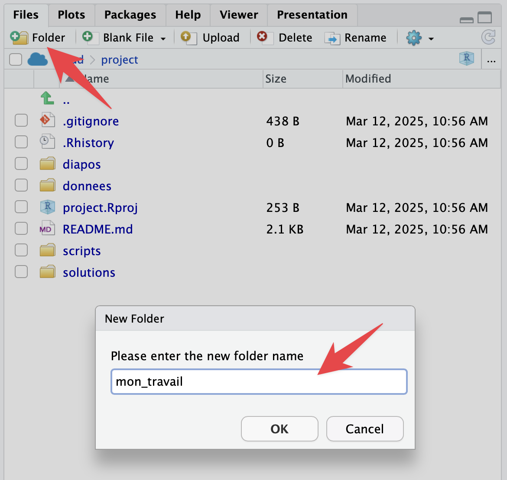
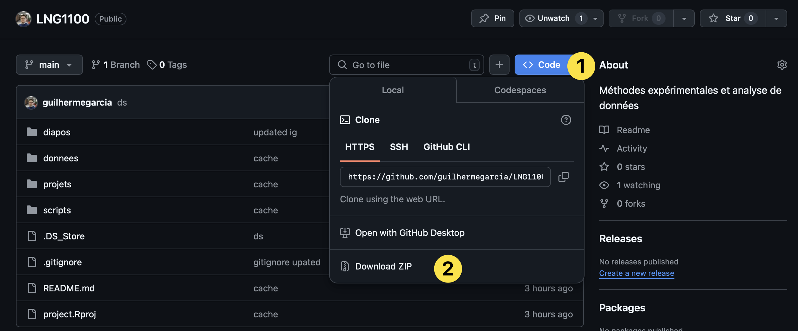
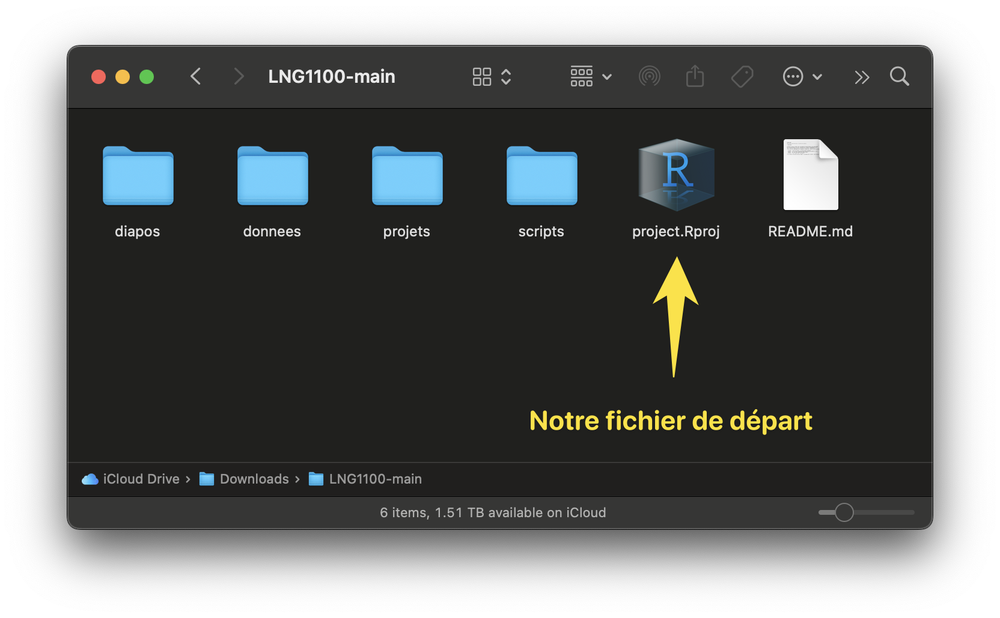

```{=html}
<style>
img.wrapfig {
float: right; 
margin: 10px;
}
</style>
```
```{r setup, include = FALSE}
knitr::opts_chunk$set(
    collapse = TRUE,
    comment = "#>",
    cache = FALSE,
    fig.retina=TRUE,
    # fig.width=7,    # Default width
    # fig.height=5,   # Default height
    fig.dpi=800     # High resolution
)


```
*Lisez **attentivement** ce chapitre pour vous assurer que vous serez prêt à commencer le cours.*

## Vos options pour le cours

Pendant le cours, on utilisera le langage R. Plus spécifiquement, on utilisera le logiciel RStudio, un [environnement de développement](https://fr.wikipedia.org/wiki/Environnement_de_développement) . Les deux outils sont gratuits. Il s'agit donc de deux outils différents : il faut avoir R pour utiliser RStudio. 

Vous avez **deux options** pour vous préparer, et je vous suggère de choisir les deux. Ce sont des options complémentaires.

### Option A : Posit cloud (en ligne)

**L'option la plus facile** pour suivre le cours sera d'utiliser la version en ligne de RStudio. Allez sur <https://posit.cloud> pour créer votre compte et voilà. L'avantage est claire : vous n'avez pas besoin d'installer ni R ni RStudio; vous n'aurez pas de problèmes techniques dans l'installation des extensions utilisées dans le cours; et vous n'aurez pas de difficultés avec votre système de exploitation. Toutefois, vous avez [une limite de 25 heures par mois](https://posit.cloud/plans), vu que vous utilisez les serveurs de Posit. En plus, c'est en ligne... Par conséquent, si le réseau est instable, vous risquez de rencontrer des problèmes. Voilà pourquoi il est utile de considérer aussi l'option B.

### Option B : installer R + RStudio (hors ligne)

Cliquez [ici](https://posit.co/download/rstudio-desktop/){target="_target"} pour installer R et RStudio. Il faut installer R **avant** d'installer RStudio. Si vous utilisez un Mac, il faut s'assurer que vous avez [complété correctement l'installation](https://support.apple.com/fr-ca/guide/mac-help/mh35835/mac){target="_blank"}. Veuillez noter que, si votre système d'exploitation est trop ancien, il se peut que vous ne puissiez pas installer les outils (donc, utilisez juste la version en ligne).

::: {.callout-tip collapse="false"}
## Suggestion

**Utilisez toujours la version en ligne**, mais installez R et RStudio aussi pour pratiquer chez vous et pour ne pas utiliser votre limite de temps en ligne.

:::  

## Ouvrez RStudio

Lorsque vous avez créé votre compte sur <http://posit.cloud>, vous verrez `Your Workspace` et vous pourrez créer votre premier projet en cliquant sur `New Project` et `New RStudio Project`. Dans la version hors ligne, vous n'avez pas besoin de créer un projet pour examiner l'interface du logiciel, qui sera identique dans les deux versions. Voici ce que vous verrez :

{width="85%"}

Dans la capture d'écran ci-dessus, vous voyez trois grandes zones :

1. La *Console* nous permet d'interagir avec le langage de façon immédiate. Le **Terminal** est dans le deuxième onglet de cette zone
2. L'onglet *Files* est maintenant actif dans la zone 2. Il nous montre les fichiers dans notre répertoire, qui est vide maintenant.
3. L'onglet *Environment* liste les variables et les objets créés. 


### Comment télécharger mettre à jour vos fichiers

::: {.callout-tip collapse="false"}

## VERSION EN LIGNE {#sec-cloner}

Vous devez simplement suivre les étapes suivantes :

1. Cliquez sur `New Project` 
2. Cliquez sur `New Project from Git Repository` et collez `https://github.com/guilhermegarcia/LNG1100.git`
3. Créez un nouveau dossier pour votre travail : `mon_travail`. C'est dans ce dossier que vous ajouterez vos fichiers et toutes vos annotations.

Pendant notre cours, je modifierai et j'ajouterai des fichiers dans notre projet. Chaque fois que vous voulez mettre à jour les fichiers, utilisez les commandes suivantes dans le **Terminal** :

- `git fetch origin` <kbd>Entrée</kbd>
- `git reset --hard origin/main` <kbd>Entrée</kbd>

<!-- <span style="color:red">**IMPORTANT :** toutes vos annotations et modifications qui ne sont pas dans le dossier `mon_travail` seront effacées!</span> -->
:::

{width="85%"}


#### Version hors ligne

Allez sur le dépôt Git du cours et téléchargez tous les fichiers (cliquez sur la figure ci-dessous). Ensuite, placez le dossier téléchargez dans un répertoire logique dans votre ordinateur (peut-être vous avez déjà un grand dossier avec tous les dossiers de vos cours).

{width="85%"}

Explorez le dossier téléchargé pour vous assurez que le fichier `project.RProj` est là. <span style="color:red">**Cliquez toujours sur ce fichier pour ouvrir RStudio dans ce cours!**</span>


{width="85%"}


## Quelques suggestions

Voici quelques modifications suggérées. Vous pouvez cliquer sur les captures d'écran ci-dessous pour les agrandir. On va modifier quelques éléments dans RStudio (peu importe si vous choisissez la version en ligne ou hors ligne). Pour ouvrir les réglages du système, allez à `Tools > Global Options...`. 

{width="85%"}

{width="85%"}

{width="85%"}


## Installer `tidyverse`

Après avoir créé votre compte sur <http://posit.cloud>, et après avoir installé R et RStudio, ouvrez RStudio pour installer l'extension `tidyverse` : tapez `install.packages("tidyverse")` <kbd>Entrée</kbd> dans la console. Vous devez suivre la même étape dans la version en ligne et hors ligne, vu que les deux ne sont pas connectées l'une à l'autre. L'installation peut être problématique selon votre système d'exploitation. Si vous avez des problèmes, consultez le chapitre sur des [problèmes techniques](problemes.qmd), utilisez Google/GPT/Gemini/etc. Si vous n'êtes pas capable d'installer l'extension, priorisez la version en ligne (où l'installation sera facile). <span style="color:red">Il ne sera pas possible de suivre le cours sans avoir installé `tidyverse`.</span>


Consultez les matériels sur monPortail et lisez le chapitre 6 de @barnier_R [ici](https://juba.github.io/tidyverse/06-tidyverse.html){target="_blank"} pour plus des détails.

{width="95%"}

## Synthèse

Voici les étapes que vous devriez avoir accomplies jusqu'à présent (et qui seront essentielles pour suivre le cours). **Assurez-vous que toutes ces étapes soient complétées avant de continuer**.

1. Installer R et RStudio et créer un compte sur <https://posit.cloud>
2. Ajuster les réglages du RStudio
3. Créer un projet RStudio à partir d'un dépôt Git
4. Installer `tidyverse`
