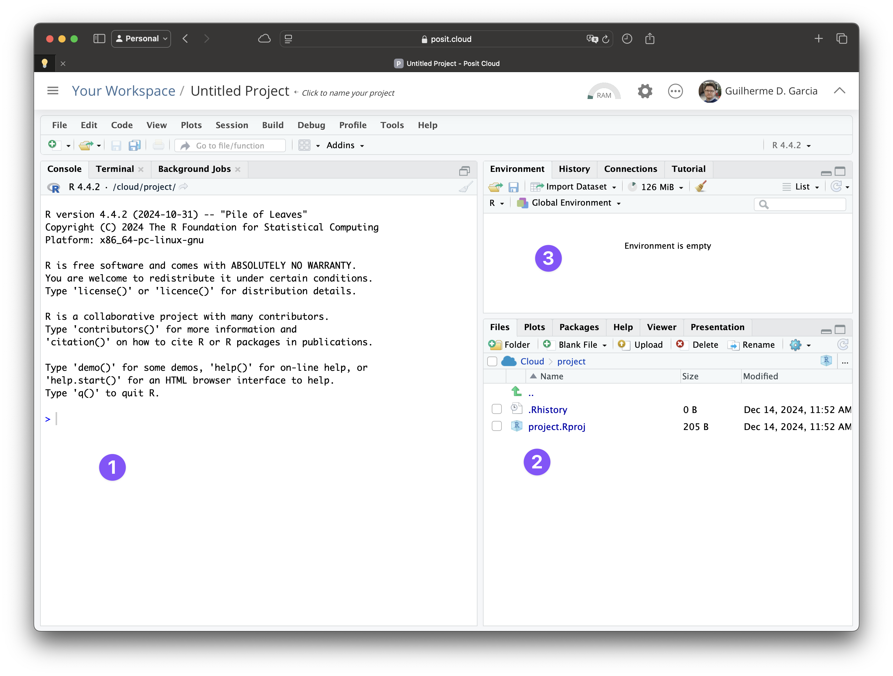
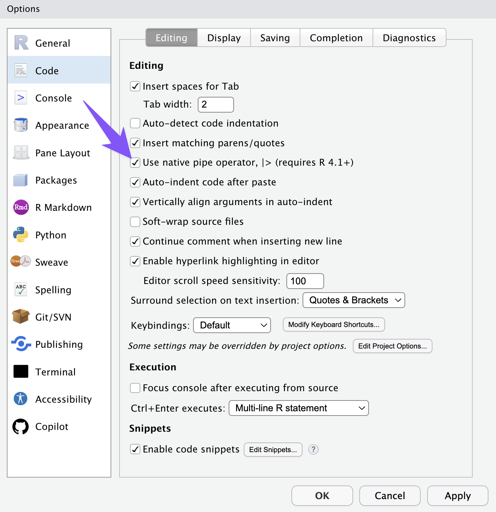
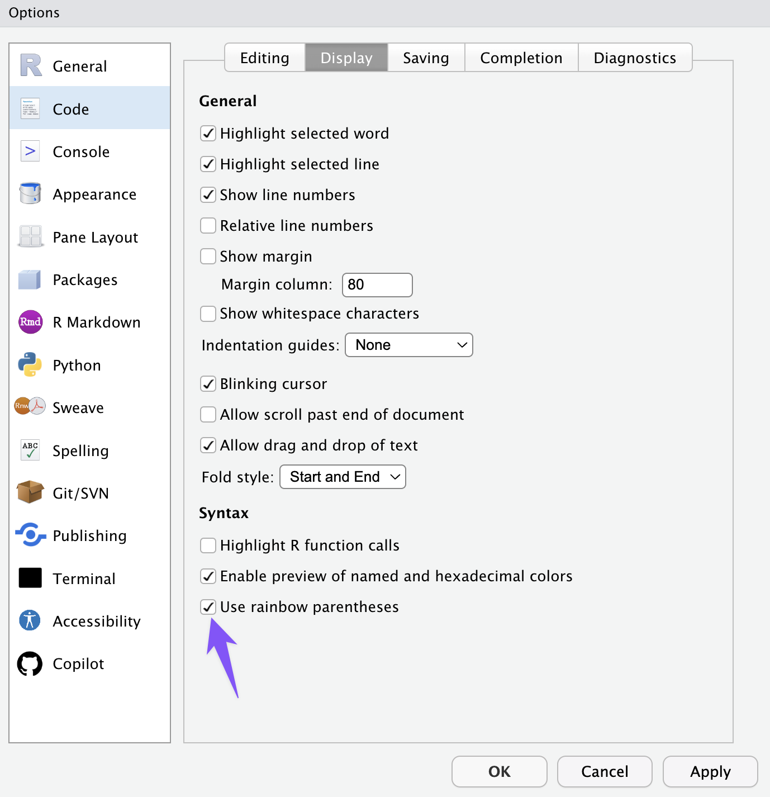
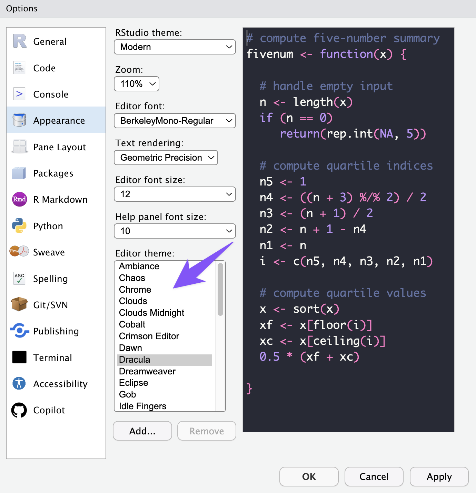

```{=html}
<style>
img.wrapfig {
float: right; 
margin: 10px;
}
</style>
```
```{r setup, include = FALSE}
knitr::opts_chunk$set(
    collapse = TRUE,
    comment = "#>",
    cache = FALSE,
    fig.retina=TRUE,
    # fig.width=7,    # Default width
    # fig.height=5,   # Default height
    fig.dpi=800     # High resolution
)


```
*Lisez **attentivement** ce chapitre pour vous assurer que vous serez prêt à commencer le cours.*

## Créer le projet du cours dans Posit Cloud {#sec-cloner}

Pendant le cours, on utilisera le langage R dans RStudio, un
[environnement de développement](https://fr.wikipedia.org/wiki/Environnement_de_développement).
La méthode normale pour le cours consiste à utiliser RStudio dans
[Posit Cloud](https://posit.cloud). Vous aurez besoin d'un compte Posit Cloud,
mais vous n'avez pas besoin d'installer R, RStudio ou Git sur votre ordinateur.

Pour créer votre projet à partir du dépôt Git du cours :

1. Connectez-vous à [Posit Cloud](https://posit.cloud).
2. Cliquez sur **New Project**.
3. Choisissez **New Project from Git Repo**.
4. Collez l'adresse du dépôt :

   ```text
   https://github.com/guilhermegarcia/LNG1100.git
   ```

5. Créez le projet et attendez que RStudio s'ouvre.

Les principaux éléments du projet devraient être organisés ainsi :

```text
LNG1100/
├── LNG1100.Rproj
├── README.md
├── donnees/
├── problemes/
├── quarto/
└── scripts/
```

Le projet créé dans Posit Cloud contient les fichiers du dépôt Git. Il ne
contient toutefois pas les fichiers qui existent uniquement sur votre
ordinateur.

## Se repérer dans RStudio

Voici l'interface de RStudio :

{width="85%"}

Dans la capture d'écran ci-dessus, vous voyez les zones principales :

1. La *Console* permet d'interagir immédiatement avec R. Le **Terminal** se
   trouve dans un autre onglet de cette zone.
2. L'onglet *Files* montre les fichiers et dossiers du projet.
3. L'onglet *Environment* liste les variables et objets créés.

## Installer `tidyverse`

Le cours utilise l'ensemble de bibliothèques `tidyverse`. Dans la console de
RStudio, exécutez :

```r
install.packages("tidyverse")
```

Attendez la fin de l'installation, puis vérifiez qu'elle a réussi :

```r
library(tidyverse)
```

`install.packages("tidyverse")` installe les bibliothèques dans votre projet
Posit Cloud et ne doit normalement être exécuté qu'une seule fois dans ce
projet. `library(tidyverse)` les charge dans une séance de travail et doit être
exécuté chaque fois qu'un script en a besoin. Il ne sera pas possible de suivre
le cours sans avoir installé `tidyverse`.

Si l'installation échoue, consultez le chapitre sur les
[problèmes techniques](problemes.qmd). Consultez également les matériels sur
Brio et le chapitre 6 de @barnier_R
[ici](https://juba.github.io/tidyverse/06-tidyverse.html){target="_blank"}.

{width="95%"}

## Vérifier la racine du projet

Dans la console de RStudio, exécutez :

```r
file.exists("donnees/base/villes.csv")
```

Si R affiche `[1] TRUE`, le projet est ouvert correctement. Si R affiche
`[1] FALSE`, vérifiez que vous avez bien créé le projet à partir du dépôt Git du
cours. Au besoin, créez un nouveau projet en répétant les étapes de la
[première section](#sec-cloner).

Dans l'onglet **Files**, vous devriez également voir les dossiers `donnees`,
`problemes`, `quarto` et `scripts`.

## Ajouter de nouveaux fichiers

Lorsque vous téléchargez un nouveau fichier pour le cours :

- placez les fichiers de données (`.csv`, `.RData`, etc.) dans `donnees`;
- placez les scripts R (`.R`) dans `scripts`;
- placez les fichiers associés à un problème dans le dossier du problème
  correspondant.

Ouvrez le sous-dossier approprié dans l'onglet **Files**, puis utilisez le
bouton **Upload** pour téléverser le fichier. Vérifiez ensuite qu'il apparaît
au bon endroit dans le projet.

Dans vos scripts, utilisez toujours des chemins relatifs à la racine du projet :

```r
read_csv("donnees/base/villes.csv")
```

N'utilisez pas `setwd()` et n'écrivez pas le chemin complet propre à votre
ordinateur. Les chemins relatifs permettent au même script de fonctionner sur
n'importe quel ordinateur.

## Sauvegarder son travail

Votre projet Posit Cloud conserve normalement vos modifications entre les
séances. Le dépôt Git du cours ne sauvegarde toutefois pas automatiquement les
fichiers que vous créez ou modifiez. Téléchargez régulièrement une copie de vos
scripts, rapports et autres fichiers importants sur votre ordinateur.

### Mettre à jour ou réinitialiser le projet dans Posit Cloud

Si les fichiers du cours dans votre projet Cloud ne sont plus à jour ou ont été
modifiés par erreur, ouvrez l'onglet **Terminal** de RStudio et exécutez :

```bash
git fetch origin
git reset --hard origin/main
```

La première commande récupère la version la plus récente du dépôt. La seconde
remet les fichiers suivis par Git dans exactement le même état que ceux du
dépôt du cours.

::: {.callout-warning collapse="false"}
La commande `git reset --hard` **efface toutes les modifications apportées aux
fichiers suivis par Git**. Avant de l'exécuter, téléchargez une copie de tout
script ou fichier important que vous avez modifié. Cette commande ne récupère
pas les fichiers qui existent uniquement sur votre ordinateur.
:::

Si vous préférez repartir à neuf, vous pouvez aussi créer un nouveau projet
Posit Cloud à partir du dépôt Git en répétant les étapes de la
[première section](#sec-cloner).

## Plan de secours : travailler localement

Si Posit Cloud est temporairement indisponible, vous pouvez travailler dans une
installation locale de RStudio. R et RStudio sont deux outils distincts : il
faut installer R **avant** d'installer RStudio. Vous pouvez télécharger les deux
outils à partir de la
[page d'installation de RStudio Desktop](https://posit.co/download/rstudio-desktop/){target="_blank"}.

Pour préparer une copie locale du projet :

1. Téléchargez `LNG1100.zip` à partir de Brio.
2. Décompressez le fichier ZIP.
3. Déplacez le dossier `LNG1100` dans un emplacement permanent.
4. Double-cliquez sur `LNG1100.Rproj` pour ouvrir RStudio à la racine du projet.
5. Installez `tidyverse` et vérifiez la racine du projet comme indiqué plus haut.

::: {.callout-important collapse="false"}
Dans la copie locale, ne commencez pas en ouvrant simplement RStudio ou en
double-cliquant sur un script `.R`. Commencez toujours par `LNG1100.Rproj`.
:::

## Quelques suggestions

Pour modifier les réglages de RStudio, allez à
`Tools > Global Options...`. Vous pouvez cliquer sur les captures d'écran
ci-dessous pour les agrandir.

{width="85%"}

{width="85%"}

{width="85%"}

## Synthèse

Avant de continuer, assurez-vous d'avoir accompli les étapes suivantes :

1. Créer un compte Posit Cloud.
2. Créer un projet à partir du dépôt Git du cours.
3. Vérifier que `file.exists("donnees/base/villes.csv")` retourne `TRUE`.
4. Installer et charger `tidyverse`.
5. Utiliser des chemins relatifs et ranger les nouveaux fichiers dans les bons
   sous-dossiers.
6. Télécharger régulièrement une copie de vos fichiers importants.

L'installation locale de R et de RStudio constitue le plan de secours.
