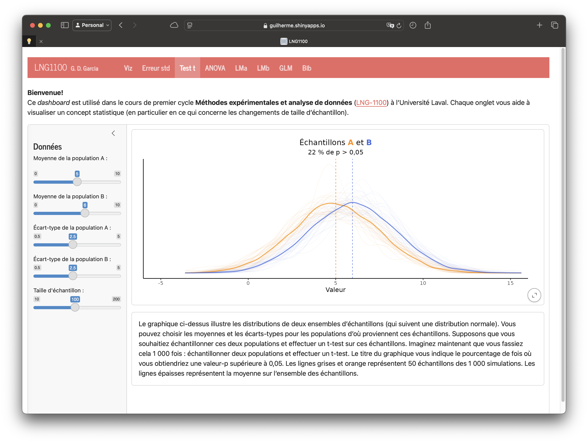

# Bienvenue! {-}

Bienvenue au livre numérique du cours ***Méthodes expérimentales et analyse de données*** (LNG-1100). Chaque chapitre est lié à une séance spécifique. *Ce livre est mis à jour fréquemment*.

## Description du cours 

> [**Méthodes expérimentales et analyse de données**](https://www.ulaval.ca/etudes/cours/lng-1100-methodes-experimentales-et-analyse-de-donnees){target="_blank"}. Introduction au design expérimental et aux méthodes quantitatives appliquées aux données linguistiques. Traitement et la visualisation de données, méthodes statistiques en linguistique et préparation des documents scientifiques. Gestion de références bibliographiques en utilisant Quarto (R Markdown).

------------------------------------------------------------------------

##  Structure du cours

Le cours contient **quatre éléments** :

1. Brio = évaluations + informations administratives
2. Teams = forum/questions générales
3. Ce site web = notre livre numérique
4. [Dépôt Git](https://github.com/guilhermegarcia/LNG1100) = tous les fichiers du cours

## Appli pour les concepts de base

Voici une [application](http://guilherme.shinyapps.io/LNG1100/){target="_blank"} qui ser autilisée en classe pour visualiser des concepts de bases qui seront discutés et apliqués pendant le cours.

[{width="70%" fig-align="center"}](http://guilherme.shinyapps.io/LNG1100/)

## Questions?

Consultez la page d'informations techniques et de dépannage [**ici**](problemes.html). Si vous avez des questions, n'hésitez pas à utiliser le forum sur monPortail. Vous pouvez également [prendre rendez-vous](https://outlook.office.com/bookwithme/user/bb12a9491ddc4ea0bd15ca785f87378d@lli.ulaval.ca?anonymous&ep=plink){target="_blank"}. Enfin, n'oubliez pas de consulter la page du cours sur monPortail pour télécharger des fichiers pertinents.

------------------------------------------------------------------------
