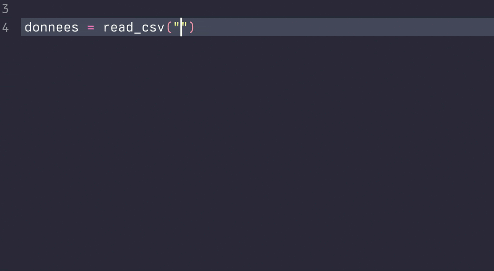

```{=html}
<style>
kbd {
    padding: 2px 4px;
    font-size: 0.85em;
    color: #555;
    background-color: #f7f7f7;
    border: 1px solid #ccc;
    border-radius: 3px;
    box-shadow: 0 1px 0 rgba(0,0,0,0.2), 0 0 0 2px #ffffff inset;
    white-space: nowrap;
}
</style>
```
```{r setup, include = FALSE}
knitr::opts_chunk$set(
  collapse = TRUE,
  comment = "#>"
)
```
>  @barnier_R (chap. 1--3; 5--7)


Ce chapitre se concentre sur des exercices de pratique pour vous familiariser avec R. Votre pratique maintenant sera essentielle pendant le cours : considérez ce temps-ci comme un investissement. Les exercices sont basés sur la lecture des chapitres de @barnier_R. 


::: {.callout-important collapse="false"}
## Comment organiser vos réponses

Créez un script séparé pour les exercices de chaque chapitre. Par exemple, `script_ch2.R` serait le script où vous répondez à toutes les questions ci-dessous. C'est une façon simple d'avoir une structure organisée pour vos fichiers. Après, enregistrez ce script dans un dossier logique (vous pouvez créer un nouveau dossier pour vos scripts/réponses). 
:::

## Les vecteurs

️ **Question 1.** Créez un nouveau script (`script_1.R`). Dans le script, créez un objet (vecteur) avec les nombres `5, 10, 15, 20, 25, 30, 35, 40, 45, 50`.


️ **Question 2.** Créez un objet (vecteur) avec quelques mots (caractères). Vérifiez la classe de l'objet.


️ **Question 3.** Créez un objet avec des nombres et des mots. Quelle sera la classe de cet objet?


️ **Question 4.** Créez un objet, `moyenne`, avec la moyenne de l'objet créé ci-dessus (1). Faites la même chose pour l'écart-type `et`.


::: {.callout-note title="Extra : Variance et écart-type" collapse="true"}
Explorons les concepts de variance et d'écart-type. 

<!-- Prenons l'objet défini plus tôt : -->

<!-- `mesNombres = c(5, 10, 15, 20, 25, 30, 35, 40, 45, 50)` -->

**La formule de la variance d'échantillon :**

$$
\text{Variance} = s^2 = \frac{\sum_{i=1}^{n} (x_i - \bar{x})^2}{n-1}
$$

Pour calculer **manuellement** la dispersion (c.-à-d. la variance) :

1.  Soustrayez la moyenne des éléments dans un objet et élevez le tout au carré.
2.  Additionnez le résultat et divisez-le par le nombre d'éléments dans l'objet - 1.

Heureusement, R nous donne une fonction pour automatiser ce calcul : la fonction `var()`. Testons-la avec nos exemples :

Finalement, on peut calculer l'écart type en prenant la racine carré de la variance.

**La formule de l'écart-type d'échantillon :**

$$
\text{Écart-type} = s = \sqrt{\frac{\sum_{i=1}^{n} (x_i - \bar{x})^2}{n-1}}
$$

```{r}
#| eval: false
sqrt(
  sum((objet - moyenne)^2) / (length(objet)-1)
)
```

Ou, plus simplement, on utilise la fonction `sd()`.

```{r}
#| eval: false
sd(mesNombres)
```
:::

C'est très facile de calculer la variance et l'écart-type en R avec les fonctions de base : `var()` et `sd()`. Dans notre cours, on va utiliser l'écart-type fréquemment (il est plus intuitif que la variance).

```{r}
#| eval: false
# La variance d'un objet numérique
var(objet)

# L'écart-type d'un objet numérique
sd(objet)
```
::: {.callout-note collapse = "false"}

## L'opérateur d'affectation

Traditionnellement, on utilise `<-` pour créer une variable en R. Ici, on utilise `=`, qui sert le même objectif. Bien que les deux soient acceptables, il y a une préférence pour `<-` dans le LSP (*Language Syntax Protocol*) du langage.

:::


------------------------------------------------------------------------

## Les vecteurs en détail

️ **Question 5.** Créez un vecteur `langues` avec les mots `français`, `anglais`, `espagnol` et `allemand`. Nommez-le `langues`.


️ **Question 6.** Exécuter la commande `nchar(langues)`. Quelle est la réponse?


️ **Question 7.** Comment ordonner alphabétiquement les langues?


️ **Question 8.** Quelle sera la conséquence d'exécuter `langues = sort(langues)`?

::: {.callout-important collapse="false"}

## Comment nommer nos variables?

Il est toujours important d'être cohérent. Nos variables auront fréquemment plus d'un mot, donc il faut décider comment combiner les mots de façon intuitive. Les deux façons les plus populaires de nommer nos variables sont `cammelCase` et  `snake_case`.

:::

## Les tableaux

Les tableaux sont les objets les plus importants (normalement). Bien que nous les importions à partir d'un fichier, il est possible de créer un tableau ici manuellement. Un tableau est simplement une collection des vecteurs (chaque colonne est un vecteur). C'est pourquoi il est important de bien connaître les vecteurs.

Il y a plusieurs types de tableaux : tibbles, data frames, data tables sont les plus importants. On va se concentrer sur les tibbles, qui peuvent être créées avec la fonction `tibble()` ou `tribble()`. Tapez `?tibble()` et `?tribble()` pour comprendre les différences entre elles. Il faut charger l'extension `tidyverse` pour utiliser ces fonctions (qui proviennent de l'extension `tibble`, incluse dans `tidyverse`).

Voici un exemple d'un tableau (tibble) en deux formats : **large** et **long**.

### Un tableau large

Il s'agit d'un tableau où plusieurs colonnes représentent une même variable. Ici, `phonologie`, `syntaxe` et `phonetique` pourraient être classé dans une même variable : `cours`. En plus, des tableaux larges contiennent plus d'une observation par ligne : ici, on voit **trois** notes par ligne.

```{r}
#| message: false
#
library(tidyverse) 

# Large
large = tribble(~id, ~phonologie, ~syntaxe, ~phonetique,
                "PLK",        80,       55,          92,
                "GP",         67,       79,          83,
                "MFG",        72,       99,          90)

# La fonction tribble permet de créer manuellement un tableau ligne par ligne

large
```

### Un tableau long

Dans le tableau long ci-dessous, chaque ligne représente **une seule** observation, et chaque colonne représente **une seule** variable. Ce type d'organisation de données est appelé *tidy data* en anglais. Notez que les contenus des deux tableaux ici sont **identiques**.

```{r}
#| message: false
#
# Long
long = tribble(~id,           ~cours,     ~note,
               "PLK",   "phonologie",        80,
               "PLK",      "syntaxe",        55,
               "PLK",   "phonetique",        92,
               
               "GP",    "phonologie",        67,
               "GP",       "syntaxe",        79,
               "GP",    "phonetique",        83,
               
               "MFG",   "phonologie",        72,
               "MFG",      "syntaxe",        99,
               "MFG",   "phonetique",        90)


# Visualiser le tableau :
long
```

### Transformation *wide-to-long*

On utilise `tidyverse` (spécifiquement l'extension `tidyr`) pour transformer un tableau de large à long et vice-versa.

```{r, collapse=FALSE}
#
large |> 
  pivot_longer(names_to = "cours", #<1>
               values_to = "note", #<2>
               cols = phonologie:phonetique) #<3>
```

1.  `names_to` : Le nom de la nouvelle colonne pour les noms des colonnes dans le tableau original (large)
2.  `values_to` : Le nom de la nouvelle colonnes pour les valeurs (les notes ici)
3.  `cols` : Quelles colonnes sont ciblées pour la transformation

Voici une figure de @wickham_rdata2023 (<a href = "https://r4ds.hadley.nz/data-tidy.html#how-does-pivoting-work" target = "_blank">chapitre 6</a>) qui nous aide à visualiser ce genre de transformation :

{width="70%" fig-align="center" fig-alt="Démonstration visuelle de la transformation wide-to-long"}


### Transformation *long-to-wide*

On peut aussi générer un tableau large à partir d'un tableau long.

```{r}
#
long |> 
  pivot_wider(names_from = cours,
              values_from = note)
```

------------------------------------------------------------------------

Quand on travaille avec plusieurs colonnes (soit le tableau large ou long), il est utile de transposer les données pour être capable de visualiser rapidement toutes les colonnes sur l'écran. On peut utiliser la fonction `glimpse()` :

```{r}
#
glimpse(large)

glimpse(long)
```

::: {.callout-note title="Le « pipe » : `|>` ou `%>%`" collapse="true"}
Le « pipe » (\|\>) permet de combiner plusieurs fonctions dans une ordre beaucoup plus intuitive. Le raccourci pour le « pipe » est {{\< kbd `Command+shift+M` \>}} (Mac) ou {{\< kbd `ctrl+shift+M` \>}} (Windows). Examiner le code ci-dessus pour comparer deux versions d'une même séquence de commandes. L'utilisation du « pipe » rend le code beaucoup plus facile à lire. Veuillez noter que `|>` est la version native de `%>%`, un autre « pipe » de l'extension `magrittr`, incluse dans `tidyverse` (consultez les diapos pour apprendre comment définir `|>` par défaut dans RStudio).

```{r}
#
# Filtrer les donnes et créer une nouvelle colonne (note au carré) sans utiliser le « pipe » :
mutate(filter(long, note > 70), note_carre = note^2)

# Avec le « pipe » :
long |> 
    filter(note > 70) |> 
    mutate(note_carre = note^2)
```
:::

 **Question 9.** Quel type de tableau est le meilleur pour l'analyse de données à vos avis...?

 **Question 10.** Quel type est le plus pour les résultats des questionnaires à partir des sites tels que Google Forms ou MS Forms?

️ **Question 11.** Comment calculer la moyenne générale des notes? Et l'écart-type?

️ **Question 12.** Comment créer une nouvelle colonne qui calcule la distance entre les notes et 100?

️ **Question 13.** Comment filtrer seulement les notes supérieures à 70?


️ **Question 14.** Comment calculer la moyenne *par cours*?


##  Pratique {-}


 **Question 15.** 
Importer le fichier `sampleData.csv`. Donnez-lui le nom `donnees`. Examinez les données attentivement pour comprendre leur structure.

::: {.callout-warning title="Où est mon fichier...?" collapse="true"}
Heureusement, RStudio vous aide à trouver des fichier si vous appuyez sur le <kbd>Tab</kbd>. Il est pourtant très utile de bien connaître la structure des fichiers dans notre projet. Si vous avez téléchargé les fichiers du cours comme indiqué, les chemins des fichiers seront plus faciles et logiques, étant données l'organisation de nos dossiers. Heureusement, RStudio effectue une **recherche récursive** dans les fichiers de votre projet. Donc, vous n'avez pas besoin d'ajouter `donnees/mon_fichier.csv`. Il suffit d'écrire `mon_fichier.csv` et <kbd>Tab</kbd> et RStudio listera le fichier même s'il est dans un dossier ou sous-dossier, ce qui sera très pratique dans notre cours!

<!-- {width=80%} -->

:::

 **Question 16.** Les données sont-elles *tidy*? Autrement dit, le tableau est-il **large** ou **long**?


 **Question 17.** Quelles sont les moyennes et les écarts-types des tests? Votre réponse doit inclure la fonction `summarize()`.

 **Question 18.** Les moyennes du groupe `control` sont-elles supérieures ou inférieures aux celles du groupe `target`?

 **Question 19.** Commment ajouter une colonne qui contient la note au carré? Si vous utilisez Google ou ChatGPT, quel type de question posez-vous?

 **Question 20.** Filtrez les données pour conserver seulement les étudiants dont les notes sont supérieures ou égales à 7.


## Extra : `tidyverse`

Les neuf extensions dans `tidyverse` sont très utiles pour les différents éléments de l'analyse de données. Dans la figure ci-dessous, vous pouvez observer le rôle de chaque extension dans un projet typique d'analyse quantitative. Dans notre cours, on utilisera spécialement `readr` pour importer des données; `tidyr` pour organiser des tableaux; `dplyr` pour transformer des variables; et `ggplot2` pour visualiser des patrons pertinents.

{width="100%"}

------------------------------------------------------------------------

