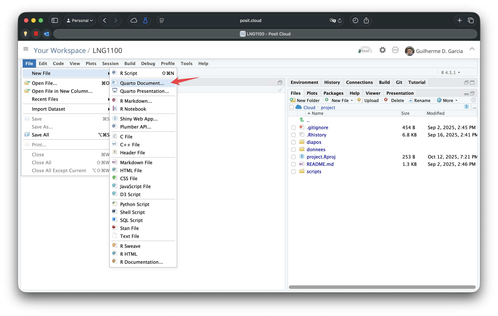
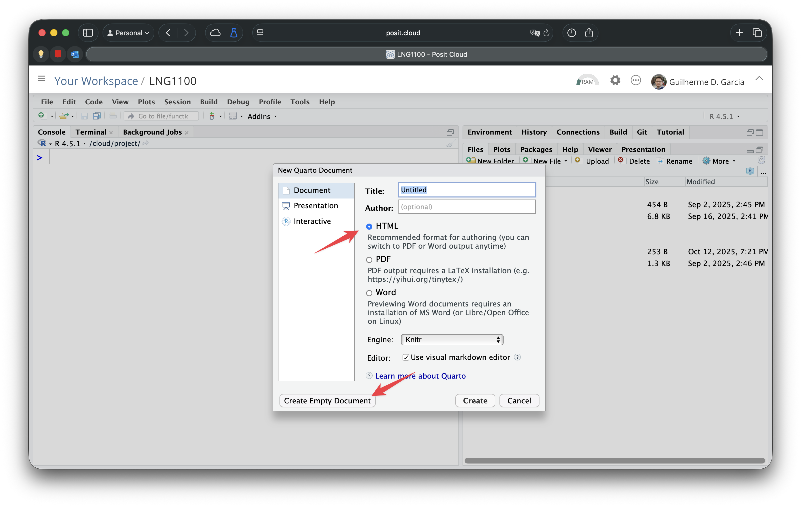

```{=html}
<style>
img.wrapfig {
float: right; 
margin: 10px;
}
</style>
```
```{r setup, include = FALSE}
knitr::opts_chunk$set(
    collapse = TRUE,
    comment = "#>",
    fig.retina=TRUE,
    # fig.width=7,    # Default width
    # fig.height=5,   # Default height
    fig.dpi=800     # High resolution
)


```

# Quarto et markdown {-}


Vous aurez besoin de Quarto (extension `.qmd`) pour compléter les deux problèmes du cours. Lisez le `PDF` dans le dossier `quarto` ([dépôt Git](https://github.com/guilhermegarcia/LNG1100){target="_blank"}) pour mieux comprendre comment créer un document Quarto. Les problèmes auront un modèle à suivre (`.qmd`). Cette page vous donne une petite introduction au système.

## Introduction

Vous utilisez peut-être Microsoft Excel pour l'analyse de données et Microsoft Word pour la communication de vos résultats dans un document de texte. Bien que ces logiciels soient utiles, ils ne sont pas suffisants pour les besoins des scientifiques. Normalement, on a besoin de trois **éléments** (c'est-à-dire trois types d'outils) dans le monde académique/scientifique :

1.  l'analyse de données
2.  la composition des documents (articles, diapos, affiches, livres)
3.  la gestion des références bibliographiques


Il y a plusieurs options pour chaque élément ci-dessus. Dans les sciences sociales, beaucoup de gens utilisent SPSS pour l'analyse de données, Microsoft Word pour la composition des articles et des livres, et EndNote pour la gestion des références, par exemple. Mais cette combinaison d'outils n'est pas de tout la meilleure option disponible. On pourrait utiliser R pour l'analyse de données, $\LaTeX$ (ou typst) pour la composition des documents et pour la gestion de références (`bibtex`). $\LaTeX$ est un [langage et un système de composition](https://fr.wikipedia.org/wiki/LaTeX){target="_blank"} de documents. J'utilise ce système pour tous mes documents : les diapos utilisées en classe sont créées avec $\LaTeX$. Le problème avec $\LaTeX$ est la courbe d'apprentissage : c'est un système difficile à apprendre. Heureusement, on peut l'utiliser **indirectement**.

Dans notre cours, on va utiliser [**Quarto**](https://quarto.org) dans RStudio (ou Positron). Simplement dit, Quarto nous permet d'utiliser R et $\LaTeX$ (ou typst) dans un même document. La partie de l'analyse de données aura des codes R, et la partie textuelle sera écrite avec [Markdown](https://fr.wikipedia.org/wiki/Markdown){target="_blank"}, un langage très simple pour produire des documents. Imaginez un logiciel qui combine Microsoft Word et Excel dans le même document.

Il y a trois avantages d'utiliser Markdown :

1.  C'est un langage très simple à apprendre
2.  Le langage peut être traduise vers plusieurs types de document : `PDF` avec $\LaTeX$, `docx`, `HTML`
3.  La gestion de références bibliographiques peut être automatisée

**Pour nos deux problèmes**, on va utiliser Quarto à partir d'un modèle spécifique. Ici, on va examiner comment créer notre premier document avec Quarto.

## Installation

Pour créer votre premier document Quarto, cliquez sur `File > New File > Quarto Document...` et cliquer sur `Create Empty Document`. Finalement, enregistrer votre ficher Quarto, dont l'extension sera toujours `.Qmd`. Il est peut-être une bonne idée de l'enregistrer dans un dossier spécifique pour ce genre de documents. Dans notre projet, vous trouverez un modèle dans le dossier `quarto`.

{width="90%" fig-align="center"}

::: {.callout-tip collapse="false"}
## Quel format...?

Vous avez trois options principales : `PDF`, `HTML`, ou `docx`. Dans notre cours, on utilise des documents `PDF`, donc vous devrez soumettre vos problèmes dans ce format. Toutefois, c'est une bonne idée de travailler avec le format `HTML` et de le changer vers `PDF` jusqu'à la fin, puisque le format `HTML` est plus rapide à compiler que le format `PDF`.

{width="90%" fig-align="center"}

:::

Pour utiliser Quarto, il faudra peut-être installer quelques extensions. RStudio affichera une notification pour les installer. Suivez les instructions. Si vous ne voyez pas un message pour l'installation automatique de `tinytex`, exécutez la commande `quarto install tinytex` dans votre **Terminal**. `tinytex` sera nécessaire pour générer des documents en format PDF à partir de Quarto.


## Un modèle

Chaque document Quarto (`*.Qmd`) commence avec le **préambule** : c'est ici que l'on spécifie le titre, le format, l'auteur, la date, etc. Heureusement, on pourrait créer un modèle complet et copier son préambule pour créer un nouveau document. Le préambule se trouve entre les deux séquences de trois traits d'union : `---`. Voici un exemple.

```{r}
#| eval: false
#| code-fold: false
---
title: "Mon document"
author: "Votre nom"
number-sections: true
date: today
lang: fr
format: pdf
bibliography: references.bib # Cette ligne sera discutée plus tard
---

# Introduction{#sec-intro}

Voici ma première section. Notez l'étiquette entre `{}`.

...
```

Après avoir défini notre préambule, on commence avec la première section : l'introduction. Vu que les documents Quarto utilisent le langage Markdown, les sections sont signalées par un `#` suivi d'un espace; les sous-sections seront signalées par `##` suivi d'un espace, etc.

::: {.callout-note title="Markdown"}
Pour apprendre les commandes les plus importantes en Markdown, visitez la [page de Quarto](https://quarto.org/docs/authoring/markdown-basics.html){target="_blank"}.
:::

La séquence `{#sec-intro}` est une étiquette pour identifier la section de l'introduction. Cela nous permet de créer une référence croisée en utilisant la commande `@sec-intro`. Finalement, le préambule contient une ligne pour la `bibliography`. Il faut avoir un fichier `*.bib` qui contient notre bibliothèque de références. Un fichier `.bib` est simplement un fichier de texte. Voici un exemple :

```{r}
#| eval: false
#| code-fold: false
@book{Barnier2023,
  title         = {Introduction à R et au tidyverse},
  author        = {Barnier, Julien},
  year          = {2023}
}
```

Dans l'exemple ci-dessus, `Barnier2023` sera notre mot-clé (on décide quel nom on utilisera; c'est comme une variable en R). Après avoir défini cette entrée dans notre bibliothèque, on peut citer le livre en question en utilisant la commande `@Barnier2023`, ce qui sera compilé comme « Barnier (2023) » dans notre document. En plus, l'entrée sera ajoutée à la fin du document, dans la section « Références ». Naturellement, on n'a pas besoin de créer chaque référence manuellement. Au lieu de cela, on utilise des outils tels que [Google Scholar](http://scholar.google.ca) pour copier et coller chaque référence dans notre fichier `*.bib`.

Finalement, pour produire un document quarto, on aura :

-   Un fichier `Qmd`
-   Un fichier `bib` pour nos références
-   Les figures (selon le besoin)

À partir de ces fichiers, Quarto générera notre document en `PDF` (ou en `HTML`). Le modèle utilisé dans la séance peut être téléchargé [ici](https://www.dropbox.com/scl/fi/w0f6fctfsulbb3fd5gcyg/quarto1.zip?rlkey=6ky8wsbmerxou04ftpgi8wcjh&dl=1).

##  Pratique {-} 

 **Question 1.** Créez un document `PDF` avec Quarto pour vos réponses aux questions 7--9 du [chapitre 7](analysis_lm2.qmd). Chaque question aura une section, un petit paragraphe de texte, les codes que vous avez utilisés, et leurs résultats. 

 **Question 2.** Dans votre texte, vous devez citer deux œuvres : R et tidyverse. Donc, vous devrez créer un fichier `bib` ainsi qu'un fichier `Qmd`. Consultez la suggestion ci-dessous.

 **Question 3.** Changez le format de votre document Quarto en `doc` et en `HTML` pour vérifier les différents types d'output possibles. 


:::{.callout-tip collapse=true}
## Comment trouver vos références?

Pour consulter la référence du langage R, exécutez `citation()`. Pour les extensions utilisées, exécutez `citation("nom_de_l'extension")` et voilà. Après, copiez le résultat et collez-le dans votre fichier `bib`. Pour toutes les autres références, [Google Scholar](scholar.google.ca/) est probablement l'option la plus simple. Cherchez l'œuvre d'intérêt, cliquez sur « citer » et après sur « BibTeX ». Plusieurs sites utilisent le format `bib` pour leurs citations. Donc, ce ne pas difficile de trouver la référence que vous cherchez. Finalement, il est toujours possible de l'ajouter manuellement (dernier recours).

:::


------------------------------------------------------------------------
